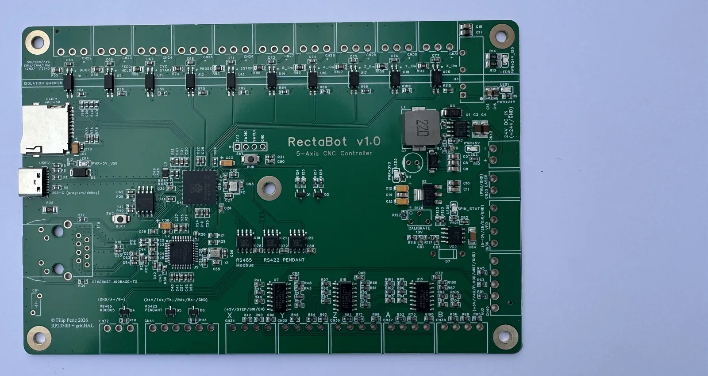

# RectaBot v1.0 — Hand-Soldered Components Reference

**Components YOU solder by hand after receiving the board from JLCPCB.**

⚠️ **IMPORTANT:** JLCPCB **DOES NOT SHIP** these components — all TH parts must be ordered separately from LCSC.
Confirmed via JLCPCB chat (Desmond, 04.06.2026):
> "If you didn't select them to be assembled at the ordering page, we will not charge them and hence we will not send them to you."

See: [LCSC_Additional_Order.csv](../Manufacturing/LCSC_Additional_Order.csv) for the full list with LCSC codes.

---

## 📥 How the board arrives

This is exactly how the board ships from JLCPCB: **all SMT parts pre-assembled**, but **none of the through-hole components** — no screw terminals, no RJ45, no DC/DC module, no SWD header, and none of the electrolytic / trim-pot / Zener. You add the 28 TH parts listed below by hand.

---

## 📦 Component list (by designator)

| # | Designator | Value | Footprint | LCSC | Mounting |
|---|---|---|---|---|---|
| 1 | **C7** | 100µF electrolytic | TH BD6.0-P2.50 | C2873969 | Vertical, watch polarity (-/+ on silkscreen) |
| 2 | **C61** | 1nF / 2kV ceramic | TH L6.8-W2.6-P5.08 | C2976624 | Bob Smith chassis coupling |
| 3 | **CN22** | KF2EDGR-3.5-3P | TH 3-pin | C441172 | RS485 Modbus |
| 4 | **CN23** | KF2EDGR-3.5-3P | TH 3-pin | C441172 | FEED HOLD input |
| 5 | **CN24** | KF2EDGR-3.5-3P | TH 3-pin | C441172 | CYCLE START input |
| 6 | **CN25** | KF2EDGR-3.5-3P | TH 3-pin | C441172 | PROBE input |
| 7 | **CN26** | KF2EDGR-3.5-3P | TH 3-pin | C441172 | ESTOP input |
| 8 | **CN27** | KF2EDGR-3.5-3P | TH 3-pin | C441172 | B_LIMIT input |
| 9 | **CN28** | KF2EDGR-3.5-3P | TH 3-pin | C441172 | A_LIMIT input |
| 10 | **CN29** | KF2EDGR-3.5-3P | TH 3-pin | C441172 | Z_LIMIT input |
| 11 | **CN30** | KF2EDGR-3.5-3P | TH 3-pin | C441172 | Y_LIMIT input |
| 12 | **CN31** | KF2EDGR-3.5-3P | TH 3-pin | C441172 | X_LIMIT input |
| 13 | **CN32** | KF2EDGR-3.5-3P | TH 3-pin | C441172 | DOOR input |
| 14 | **CN33** | KF2EDGR-3.5-2P | TH 2-pin | C441171 | Laser PWM / GND |
| 15 | **CN42** | KF2EDGR-3.5-2P | TH 2-pin | C441171 | 24V DC INPUT |
| 16 | **CN34** | KF2EDGR-3.5-4P | TH 4-pin | C441173 | X Stepper (STEP/DIR/EN/GND) |
| 17 | **CN35** | KF2EDGR-3.5-4P | TH 4-pin | C441173 | Y Stepper |
| 18 | **CN36** | KF2EDGR-3.5-4P | TH 4-pin | C441173 | Z Stepper |
| 19 | **CN37** | KF2EDGR-3.5-4P | TH 4-pin | C441173 | A Stepper |
| 20 | **CN38** | KF2EDGR-3.5-4P | TH 4-pin | C441173 | B Stepper (Y2 tandem) |
| 21 | **CN39** | KF2EDGR-3.5-4P | TH 4-pin | C441173 | Spindle VFD (10V/EN/DIR/GND) |
| 22 | **CN40** | KF2EDGR-3.5-5P | TH 5-pin | C441174 | AUX (5V/VAC/FLOOD/MIST/GND) |
| 23 | **CN41** | KF2EDGR-3.5-6P | TH 6-pin | C441175 | RS422 Pendant (24V/TX+/TX-/RX+/RX-/GND) |
| 24 | **D7** | 1N4742A Zener 12V | TH DO-41 | C140853 | Watch the cathode (band) — it faces the SPIN_10V net |
| 25 | **H1** | PZ254V-11-04P | TH 4-pin 2.54mm | C2691448 | SWD debug header |
| 26 | **R128** | PV37W103C01B00 trim pot 10k | TH PV37W | C6630214 | Spindle 0-10V gain calibration |
| 27 | **RJ1** | J1B1211CCD | TH RJ45 | C910371 | Ethernet with integrated magnetics |
| 28 | **U3** | B2424S-2WR3 | TH 4-pin DC/DC | C5369487 | Isolated 24V→24V_ISO for opto LEDs |

**Total: 28 components for hand-soldering (all come with the JLCPCB board)**

---

## 🛠️ Soldering order (recommended)

### Phase 1: Lowest-profile components first
1. **D7** Zener (bend the leads into a "P" shape for stress relief)
2. **R128** trim pot
3. **H1** SWD header

### Phase 2: Medium height
4. **C7** electrolytic (polarity! shorter lead = minus)
5. **C61** ceramic chassis cap

### Phase 3: Taller components
6. **U3** B2424S DC/DC module
7. **RJ1** RJ45 connector (careful with the shield pins)

### Phase 4: Connectors (tallest)
8. All **CN22-CN42** screw terminals (KEFA)

### Phase 5: Verification
- Visual inspection of solder joints
- Continuity test with the multimeter (GND to main pins)
- Power-on test without main components connected

---

## ⚠️ Specific notes

### **D7 1N4742A Zener — polarity CRITICAL**
- The cathode (band on the body) faces **SPIN_10V** (output signal)
- The anode (no band) goes to **GND**
- If reversed → the Zener never conducts → no VFD protection

### **C7 100µF electrolytic — polarity CRITICAL**
- The positive lead (longer) faces the **+5V** side
- The negative lead (shorter, white band on the can) faces **GND**
- If reversed → explosion on first power-on!

### **RJ1 RJ45 — watch the shield pins**
- It has 2 extra pins for chassis ground/shield
- They must be soldered for EMI performance
- Bob Smith termination works only if the shield is connected

### **R128 trim pot — calibration**
- After soldering: connect the VFD and tune so that at max PWM you get exactly 10.0V
- See [VFD_Wiring_Guide.md](../Reference/VFD_Wiring_Guide.md) for details

---

## 📋 What YOU must purchase separately (NOT in the JLCPCB package)

**ALL components on this list (28 TH parts) + male KEFA mating connectors.**

See: [LCSC_Additional_Order.csv](../Manufacturing/LCSC_Additional_Order.csv) — full BOM for 5 boards (~$50 with male connectors).
