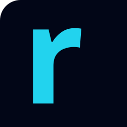

# RectaBot Brand Assets

Logo files for the RectaBot CNC controller project.

## License

These brand assets are part of the RectaBot project, licensed under **CERN-OHL-S v2** (Strong reciprocal open hardware). You may use, modify, and redistribute the logo files when including, modifying, or redistributing the RectaBot hardware design, provided you comply with the CERN-OHL-S terms.

**For derivative works:** change the wordmark to your own to avoid confusion with the upstream RectaBot project.

---

## Files

### Wordmark variants

| File | Use |
|---|---|
| `rectabot-wordmark-cyan.svg` | Primary wordmark for dark backgrounds (cyan-400 `#22d3ee`) |
| `rectabot-wordmark-white.svg` | PCB silkscreen, dark backgrounds |
| `rectabot-wordmark-dark.svg` | Light backgrounds, print, documents |

### Icon variants (square)

| File | Use |
|---|---|
| `rectabot-icon-cyan.svg` | Icon for dark backgrounds (cyan-400 square with dark `r`) |
| `rectabot-icon-light.svg` | Inverted icon |

### Combined lockup

| File | Use |
|---|---|
| `rectabot-lockup-horizontal.svg` | Icon + wordmark, for headers and banners |

### Other

| File | Use |
|---|---|
| `favicon.svg` | Favicon for web (64×64) |
| `rectabot-orbitron.svg` | Original wordmark master file |

---

## Typography

The wordmark uses **Orbitron** (Google Fonts, SIL Open Font License) at weight 900, letter-spacing `0.06em`, always lowercase.

## Color palette

| Token | Hex |
|---|---|
| Cyan 400 (primary) | `#22d3ee` |
| Slate 950 (background) | `#020617` |
| Slate 100 (text) | `#f1f5f9` |
| Cyan 300 (highlight) | `#67e8f9` |

---

## Usage examples

### HTML favicon

```html
<link rel="icon" type="image/svg+xml" href="favicon.svg">
```

### HTML wordmark

```html
<a href="#" style="display: flex; align-items: center; gap: 12px;">
  
  
</a>
```

### Font loading (for inline text using Orbitron)

```html
<link rel="preconnect" href="https://fonts.googleapis.com">
<link rel="preconnect" href="https://fonts.gstatic.com" crossorigin>
<link href="https://fonts.googleapis.com/css2?family=Orbitron:wght@400;700;900&display=swap"
      rel="stylesheet">
```

---

## Minimum sizes

- **Wordmark:** 80px wide minimum (for readability)
- **Icon:** 16px × 16px minimum (favicon size)
- **Lockup:** 200px wide minimum

## Clear space

- Around wordmark: 0.5× the height of the `r` glyph
- Around icon: 0.25× the icon side
