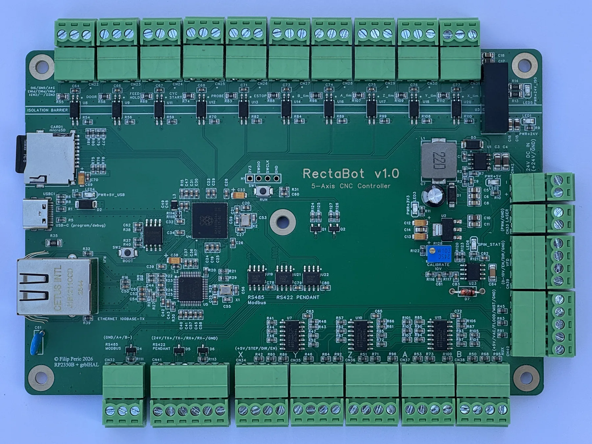
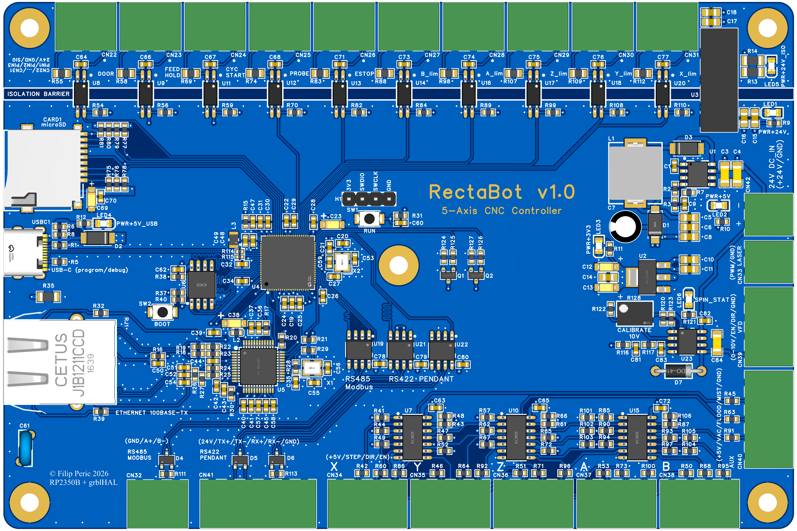

# RectaBot — 5-Axis CNC Controller

Open-source 5-axis CNC controller based on the Raspberry Pi RP2350B microcontroller running grblHAL firmware. Designed for hobby and workshop applications.

🌐 **[rectabot.org](https://rectabot.org)** — product, documentation and firmware configurator.

_RectaBot is the first piece of an open CNC ecosystem we're actively building. New parts are shared here as they're finished and verified — no roadmaps, no dates, just working hardware and software._



---

## 📊 Project Status

| | |
|---|---|
| **Current version** | v1.0 |
| **Status** | ✅ v1.0 — running a machine: homing, probing, Modbus spindle, Ethernet, SD. One interface not yet exercised: the RS-422 pendant header |
| **First production batch** | 5 boards (JLCPCB Economic PCBA + ENIG finish) |
| **Firmware** | grblHAL fork for RP2350B |
| **Software** | [RectaControl](https://github.com/rectabot/RectaControl) — desktop sender built for this board |
| **Form factor** | 150 × 100 mm, 4-layer PCB, 1.6mm |

---

## 🎯 What is RectaBot?

A 5-axis CNC controller with optical input isolation, integrated Ethernet, and a VFD interface.

### Key features

- 🧩 **Single-board, fully integrated** — no add-on driver boards, breakout modules, or level-shifter add-ons to wire up. Every active part is soldered down (only the field-wiring terminals plug in), so vibration can't work a module loose over time; high-speed step/dir and comms lines are laid out for EMI immunity. Stepper drivers stay external — this board commands DM556-class drivers rather than replacing them — and coolant needs 2–3 **optocoupler-input relay modules** on `CN40` ([which ones](Docs/Assembly/Quick_Start_Guide.md#which-relay-to-buy))
- ⚙️ **5-axis stepper control** (X, Y, Z, A, B) — PIO-based step generation up to **300kHz per axis**
- 🔌 **Spindle 0-10V interface** with overvoltage protection — compatible with Huanyang/Lapond/Delta/Hitachi VFDs
- 🛡️ **Optically isolated inputs** — all 10 field inputs through LTV-217-B-G optocouplers on a dedicated 24V_ISO rail (input side only)
- 🌐 **On-board Ethernet 10/100 Mbps** — a **discrete W5500** PHY laid out to WIZnet's reference design and their engineers' recommendations (not a plug-on module), with J1B1211CCD integrated magnetics + Bob Smith termination and controlled 100Ω differential pairs
- 💾 **MicroSD slot** for G-code files and configuration
- 🔋 **24V DC power input** (buck-regulated to 5V) — **ORing Schottky diodes** let the 24V supply and USB-C stay connected **at the same time** and hand off the 5V rail automatically; **no VBUS/5V select jumpers** to flip by hand (also blocks USB-C back-feed)
- 📡 **RS-485 Modbus + RS-422 Pendant** interfaces
- 🚦 **10 isolated inputs** + **3 auxiliary 5 V outputs** (Mist M7 / Flood M8 / Vac M62) — signal level, ~4 mA, for optocoupler-input relay modules

**Detailed specification:** [Docs/Reference/Product_Specification_v1.0.md](Docs/Reference/Product_Specification_v1.0.md)

---

## 📂 Repository structure

```
RectaBot/
├── Docs/                                # 📚 All documentation (read first!)
│   ├── Assembly/                        # Build & first power-on
│   │   ├── Quick_Start_Guide.md         # From unboxing to first motor (2-3h)
│   │   ├── First_Power_On_Procedure.md  # Safe first power-on with a multimeter
│   │   └── Hand_Solder_Components.md     # 28 TH components for hand-soldering
│   ├── Reference/                       # Electrical & design reference
│   │   ├── Product_Specification_v1.0.md # Complete datasheet/spec
│   │   ├── Pinout.md                    # RP2350B pinmap (GP0-GP47)
│   │   ├── Schematic_References.md       # Reference schematics for all ICs
│   │   ├── Hardware_Design_Guidelines.md # PCB layout guidelines
│   │   ├── VFD_Wiring_Guide.md          # VFD connection guide (analog 0-10V)
│   │   └── VFD_Modbus_Setup.md          # VFD spindle control over RS-485/Modbus
│   ├── Manufacturing/                   # Send-to-fab production data
│   │   ├── BOM_v1.0_final.csv           # Bill of Materials (~80 components)
│   │   ├── CPL_RectaBot_V1.0.csv        # Component Placement List for JLCPCB
│   │   ├── LCSC_Additional_Order.csv    # TH parts for a separate LCSC order
│   │   └── Gerber_RectaBot_1.0/         # Production-ready Gerber files
│   └── Brand_Assets/                    # Logo files (SVG) — brand reserved, not open-licensed
├── website/                             # rectabot.org — landing page, deployed by Actions
│   └── configurator/                    # Firmware picker: machine layout → the matching .uf2
│
└── (Submodules live in separate repos — see below)
```

## 🔗 Related repositories

RectaBot is split across separate GitHub repos for better modularity:

| Repo | Contents |
|---|---|
| **[rectabot/RectaBot](https://github.com/rectabot/RectaBot)** (this one) | Hardware design (Gerber), docs, BOM, brand assets, configurator tool |
| **[rectabot/RectaBot-firmware](https://github.com/rectabot/RectaBot-firmware)** | grblHAL fork with RectaBot board map + pre-built UF2 |
| **[rectabot/RectaControl](https://github.com/rectabot/RectaControl)** | Desktop sender (Electron) — settings, probing, 3D toolpath, firmware flashing |

**Clone everything at once:**
```powershell
git clone https://github.com/rectabot/RectaBot.git
git clone https://github.com/rectabot/RectaBot-firmware.git
git clone https://github.com/rectabot/RectaControl.git
```

---

## 🔧 Hardware



### Core components

| Component | Role |
|---|---|
| **Raspberry Pi RP2350B** (QFN-80) | Dual ARM Cortex-M33 @ 150MHz, 48 GPIO, 12 PIO state machines |
| **WIZnet W5500** | Hardware TCP/IP stack, 10/100 Ethernet |
| **74HC14D ×3** | Schmitt-trigger inverters for 3.3V→5V level shift (all step/dir/en signals) |
| **LTV-217-B-G ×10** | Optocouplers for all input signals (limit switches, ESTOP, probe, controls) |
| **LM358DR2G** | Op-amp for PWM→0-10V spindle interface |
| **2N7002 ×2** | Open-drain MOSFETs for VFD EN/DIR signals |
| **SP3485EN-L/TR ×3** | 3.3V native RS-485/RS-422 transceivers (1 Modbus + 2 Pendant) |
| **B2424S-2WR3** | Isolated 24V→24V DC/DC for opto LED supply |

### Power Tree

```
24V DC IN ──┬──► TPS5430 buck ──► +5V (3A)
            │                                 │
            ├──► B2424S-2WR3 isolation ──► +24V_ISO (opto LEDs)
            │
            └──► LM358 (op-amp supply, 24V rail-to-rail)

+5V ──► AMS1117-3.3 LDO ──► +3.3V (MCU, W5500, SP3485)
```

### System Block Diagram

```
                       ┌─────────────────────────────────────┐
                       │     RectaBot v1.0 — RP2350B MCU     │
                       │   (Dual Cortex-M33 @ 150MHz)        │
                       └─────────────────────────────────────┘
                                       │
       ┌───────────────────────┬───────┴───────┬───────────────────────┐
       │                       │               │                       │
       ▼                       ▼               ▼                       ▼
┌──────────────┐        ┌──────────────┐ ┌──────────────┐       ┌──────────────┐
│  MOTION      │        │  SPINDLE     │ │  AUX (RELAY) │       │  I/O & COMM  │
│              │        │              │ │              │       │              │
│ PIO step gen │        │ PWM @ 25kHz  │ │ GP0-2 →      │       │ SPI0 W5500   │
│ GP8-22 →     │        │ GP27 →       │ │ 74HC14D      │       │ UART1 RS485  │
│ 74HC14D ×3   │        │ LM358 op-amp │ │ Mist/Flood/  │       │ UART0 RS422  │
│ (Schmitt inv)│        │ + 2N7002 ×2  │ │ Vacuum       │       │ SPI1 microSD │
└──────┬───────┘        └──────┬───────┘ └──────┬───────┘       └──────┬───────┘
       │                       │                │                      │
       ▼                       ▼                ▼                      ▼
┌──────────────┐        ┌──────────────┐ ┌──────────────┐       ┌──────────────┐
│ CN34-CN38    │        │ CN39 (VFD)   │ │ CN40 (AUX)   │       │ RJ45 + USB-C │
│ 5× Stepper   │        │ 0-10V analog │ │ Mist/Flood/  │       │ + CN32 RS485 │
│ STEP/DIR/EN  │        │ EN/DIR open- │ │ Vacuum +     │       │ + CN41 RS422 │
│ (5V CMOS)    │        │ drain MOSFET │ │ 5V/VAC/GND   │       │ + microSD    │
└──────────────┘        └──────────────┘ └──────────────┘       └──────────────┘

     ─ ─ ─ ─ ─ ─ ─ ─ ─ ─ ─ INPUT-SIDE ISOLATION (10× OPTO) ─ ─ ─ ─ ─ ─ ─ ─ ─ ─ ─

                              ┌─────────────────────┐
                              │  10× ISOLATED       │
                              │  INPUTS             │
                              │                     │
                              │ LTV-217-B-G opto    │
                              │ + 24V_ISO domain    │
                              │ (B2424S-2WR3 DC/DC) │
                              │                     │
                              │ Limits, ESTOP,      │
                              │ Probe, Controls     │
                              │                     │
                              │ → CN22-CN31         │
                              └─────────────────────┘

Note: v1 isolates the input side only.
```

---

## 🚀 Quick Start

> **📦 Status:** The first batch of five v1.0 boards has been assembled, and a board has been driving a machine since: homing and hard limits, probing cycles, a Modbus VFD spindle, Ethernet, the SD card and the coolant outputs. Everything documented below is verified on hardware, with one exception — nothing has yet been connected to the **RS-422 pendant header (CN41)**. Its transceivers are populated and its pins are documented, but the link has never carried traffic, so treat that one interface as untested. Follow the assembly and wiring guides below.

**Main guides:**
- **[Quick_Start_Guide.md](Docs/Assembly/Quick_Start_Guide.md)** — Complete walkthrough from unboxing to first motor (estimated: 2-3h)
- **[First_Power_On_Procedure.md](Docs/Assembly/First_Power_On_Procedure.md)** — Safety procedure for the first power-on with a multimeter

**Main steps (summary):**
1. Visual inspection of the board (10 min)
2. Hand-soldering 28 TH components ([list](Docs/Assembly/Hand_Solder_Components.md), 60-90 min)
3. Pre-Power-On continuity tests (15 min)
4. First Power-On + LED + voltage verification (10 min)
5. Firmware flash via BOOTSEL+USB (15 min) — [the configurator](https://rectabot.org/configurator/) names the `.uf2` your motor layout needs
6. grblHAL configuration (`$$` parameters for RectaBot, 20 min) — RectaControl's Settings panel, with a steps/mm calculator
7. First axis test with a DM556 driver (10 min)
8. VFD wiring — [analog 0-10V](Docs/Reference/VFD_Wiring_Guide.md) or [RS-485/Modbus](Docs/Reference/VFD_Modbus_Setup.md)

---

## 🤝 Acknowledgments

- **[grblHAL](https://github.com/grblHAL)** community — for the incredible open-source firmware
- **Raspberry Pi Foundation** — for the RP2350 chip and accessible pricing
- **JLCPCB & LCSC** — for accessible prototype manufacturing
- **EasyEDA** — for the CAD tool that made this project possible for a solo developer

---

## 📜 License

- **Code, documentation:** MIT (see [LICENSE](LICENSE))
- **Hardware design files** (Gerber, BOM, CPL): CERN-OHL-S v2 (see [LICENSE.hardware](LICENSE.hardware))
- **Brand assets** (the name "RectaBot" + logo SVGs): **reserved — all rights reserved**, not open-licensed (see [Docs/Brand_Assets/README.md](Docs/Brand_Assets/README.md))
- **grblHAL firmware fork:** GPL-3.0 (inherits from upstream, in the separate [RectaBot-firmware](https://github.com/rectabot/RectaBot-firmware) repo)
- **RectaControl sender:** GPL-3.0 (separate [RectaControl](https://github.com/rectabot/RectaControl) repo)

---

## 📬 Contact

**Project lead:** Filip Perić
**Website:** [rectabot.org](https://rectabot.org)
**Email:** hello@rectabot.org
**Location:** Kragujevac, Serbia
